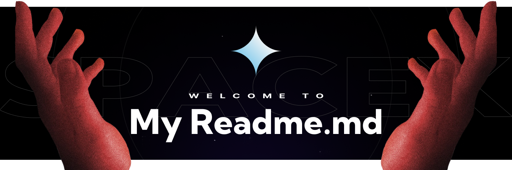

 
### <samp>&gt; Hi There! I am [Kam Wake](https://github.com/sekiro-dev) 👋</samp>
I'm Kam, a self-motivated tech enthusiast and full stack web developer currently exploring Web3 space and likes Minecraft so much. and other somthings.


[](https://t.me/nibori_me) 
[](https://discordapp.com/users/828847306173972501) 


---

### <samp>&gt; About me</samp>

- ⚙️ I use daily: .py, .js, .html, .css, .svg, .psd, .ai, .ts, .dart, ...
  
- 🌍 I'm mostly active within the **Voxystar community**
- 🔭 I’m currently working on creating better portfolio .
- 😀 I like to 🎮, </>, 📖, 🛹, 🎸, 🍪 and ✒️ in my free time.
- ⚡ Fun fact: My first line of code was not "Hello World!"

### <samp>&gt; This week I spent my time on</samp>
<!--START_SECTION:waka-->

```txt
Python       11 hrs 25 mins  ██████████████████░░░░░░░   72.17 %
TypeScript   3 hrs 35 mins   █████▓░░░░░░░░░░░░░░░░░░░   22.67 %
PHP          28 mins         ▓░░░░░░░░░░░░░░░░░░░░░░░░   02.98 %
C++          10 mins         ▒░░░░░░░░░░░░░░░░░░░░░░░░   01.12 %
Bash         6 mins          ▒░░░░░░░░░░░░░░░░░░░░░░░░   00.68 %
```

<!--END_SECTION:waka-->

<br><br>

<div align="center">
  
</div>
